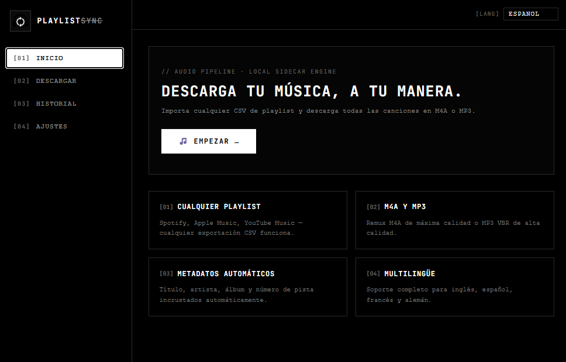

<div align="center">
  

  <h1>💽 PlaylistSync</h1>
  <p><strong>Download your music, your way. A blazing-fast desktop application to import playlist CSVs and download tracks in high-quality audio.</strong></p>

  <p>
    
    
    
    
  </p>
</div>

---

## 📸 App Preview



## ✨ Features

- 📄 **Any Playlist CSV:** Compatible with [Exportify](https://exportify.net/) (Spotify) and TuneMyMusic exports.
- 🎵 **High Quality:** Downloads best-quality audio using `yt-dlp` and `ffmpeg` (both bundled internally).
- 🏷️ **Auto Metadata:** Automatically embeds Title, Artist, Album, and Track Number into the downloaded files.
- 🌍 **Multilingual:** Full support for English, Spanish, French, and German.
- ⚡ **Plug and Play:** No need to install external dependencies like Python, FFmpeg or yt-dlp in your system path. Everything just works out of the box.

---

## 🚀 How to Run (Development)

If you have downloaded this source code and want to run it on your machine, follow these simple steps:

### Prerequisites
Make sure you have installed on your system:
- [Node.js](https://nodejs.org/) (v18 or higher)
- [Rust](https://www.rust-lang.org/tools/install)

### 1. Install Dependencies
Open your terminal in the project folder and run:
```bash
npm install
```

### 2. Start the App
Launch the app in development mode with hot-reloading:
```bash
npm run tauri dev
```
> *Note: The first time you run this command, Rust will compile the backend, which might take a few minutes. Subsequent runs will be much faster.*

---

## 📦 How to Build (Production)

To create a standalone executable (`.exe` / `.dmg` / `.AppImage`) that you can share with anyone:

```bash
npm run tauri build
```
Once finished, you will find the installer and the executable file in:
`src-tauri/target/release/bundle/`

---

## 📖 How to Use the App

1. **Export your playlist:** Go to a tool like [Exportify](https://exportify.net/) (for Spotify) or TuneMyMusic and export your playlist as a `.csv` file.
2. **Open PlaylistSync:** Go to the "Download" tab.
3. **Drag and Drop:** Drag your `.csv` file into the app.
4. **Choose your settings:** Select the output folder where you want your music saved, and pick your format (M4A recommended).
5. **Download:** Click "Start Download" and watch the magic happen. The app will search YouTube Music for the best matches and download them automatically with metadata included.

---

## 🛠️ Stack & Architecture

- **Frontend:** SvelteKit + TypeScript + Vanilla CSS (Glassmorphism design).
- **Backend:** Rust + Tauri v2.
- **Tools:** `yt-dlp` and `ffmpeg` are bundled directly inside the app as native Tauri sidecars, avoiding any messy system PATH configurations for the end user.
